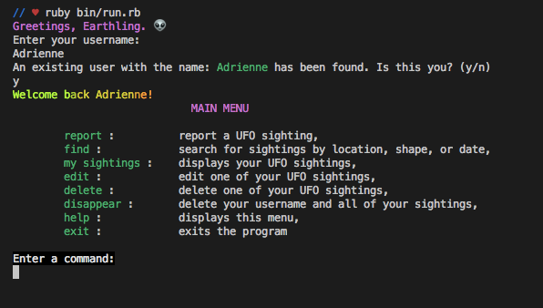

UFO Sightings CLI
========================

## Install

Gems Needed: 
    gem "sinatra-activerecord"
    gem "sqlite3"
    gem "pry"
    gem "require_all"
    gem "faker"
    gem "colorize"

Run `bundle install` in your terminal.

To seed the databse with the inital data run `rake db:seed` in your terminal. (This will take ~ 20 min, here are some videos to watch while you wait: https://www.youtube.com/results?search_query=ufo+sightings 🛸)

## Running the App

Run `ruby bin/run.rb` in your terminal to run the app.

## Usage

The following is a menu of commands that you can enter in your terminal and their description:

COMMANDS:         DESCRIPTION:

report :          report a UFO sighting,
find :            search for sightings by location, shape, or date,
my sightings :    displays your UFO sightings,
edit :            edit one of your UFO sightings,
delete :          delete one of your UFO sightings,
disappear :       delete your username and all of your sightings,
help :            displays the menu,
exit :            exits the program

You can also force quit the program with 'CTRL-c' at any time.

RE-SET DATABASE

If you would like to delete all of your database data and then repopulate it, first run the following two lines of code in 'rake console' in your terminal: 
    `User.delete_all`
    `ActiveRecord::Base.connection.execute(“DELETE from sqlite_sequence where name = 'users’”)`

Then, un-comment out lines 11-12 in the seeds.rb file and run rake db:seed again.

## Screenshots

## Authors

Kyle Conlon
Adrienne Miranda

## Acknowledgments

UFO sighting data was provided by: https://www.kaggle.com/NUFORC/ufo-sightings

Callie "Satan" Terry

👽🛸👽

